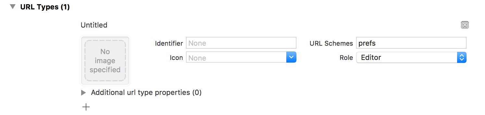

SettingsAppAccess
===

**SettingsAppAccess** is a simple iOS library that will send your Users to various locations with the _iOS Settings App_.

Installation
---
**SettingsAppAccess** is available through **[cocoapods](http://cocoapods.org)**, to install simple add the following line to your `PodFile`:

``` ruby
  pod "SettingsAppAccess"
```

Alternatively you can add the **[github repo](https://github.com/Adorkable/SettingsAppAccessiOS)** as a submodule and use **SettingsAppAccess** as a framework.

Carthage support soon!

Usage
---

#### Setup
Before you can successfully open up a location with _iOS' Settings App_ you must add a `URL Type` to handle its protocol to your app:

1. Open your app target's _Info_ page
2. Expand _URL Types_
3. Press the **+** Button to add a new _URL Type_
4. Set _URL Schemes_ to `prefs`



Now we're ready to use the library!


**SettingsAppAccess** defines the enum `SettingsAppLocation` which contains the paths to various known locations in the _iOS Settings App_.

#### `UIApplication` Extension
The library provides an extension to `UIApplication` to accept our `SettingsAppLocation` enum:

``` swift
	do {
		try UIApplication.sharedApplication().settingsAppAccess_openLocation(SettingsAppLocation.Settings)
	} catch let error as NSError {
		...
	}
```

#### Manually
One can use the enum directly to create an `NSURL`, and call `openURL`:

``` swift
	do {
		let url = try SettingsAppLocation.Settings.URL()
		let openURLResult = UIApplication.sharedApplication().openURL(url)
	} catch let error as NSError {
	    ...
	}
```

One can also use the `rawValue` of the enum directly, manually create an `NSURL`, and call `openURL`:

``` swift
	guard let url = NSURL(string: SettingsAppLocation.Settings.rawValue) {
		return 
	}
	let openURLResult = UIApplication.sharedApplication().openURL(url)
```

Contributing
---
If you have additional _iOS Settings App_ paths please feel free to create an issue or a pull request and they will get added to the library!

If you have any ideas, suggestions or bugs to report please [create an issue](https://github.com/Adorkable/SettingsAppAccessiOS/issues/new) labeled *feature* or *bug* (check to see if the issue exists first please!) or create a pull request! 

Thanks
---
This library was inspired by [this post](https://gist.github.com/phynet/471089a51b8f940f0fb4) by Sofia Swidarowicz ([http://phyline.com](http://phyline.com)) and based on her original list and all its contributers!